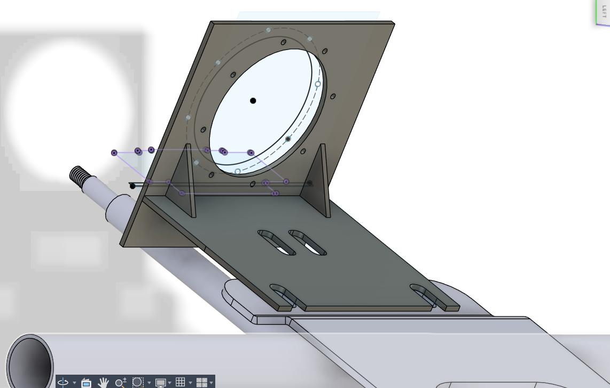
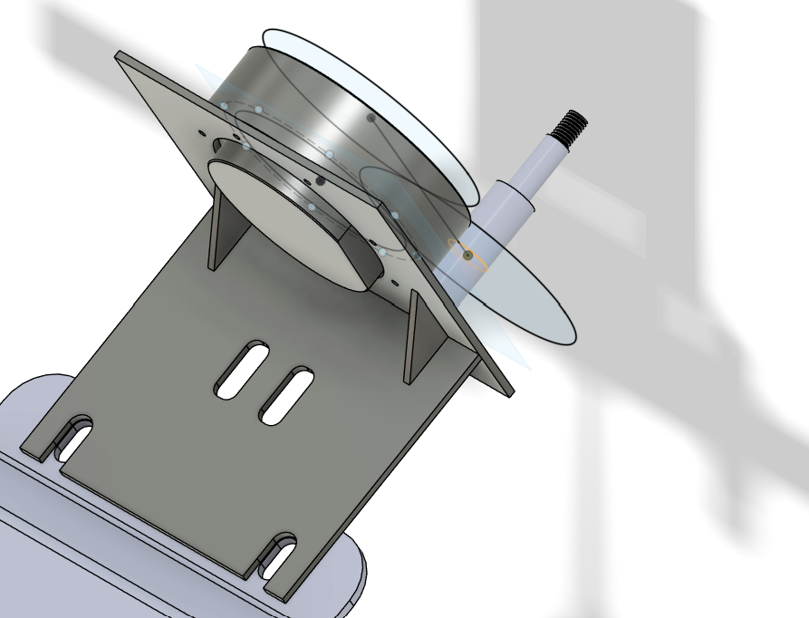

## What's in here
Step 1 is to understand the platform you are working with; this article is for those trying to convert a standard vehicle into an autonomous vehicle for research or testing. I would share ideas on how I approached the problem and the alternatives I found, along with good references.

This work primarily focuses on translating hardware systems to seamlessly interface with software, specifically in the context of electric cars.
Starting with a basic understanding of the electric vehicle powertrain, to implementing a software backbone that enables the vehicle to track a reference trajectory, with a provision for user-safety override.

The article is divided into sections
  * Vehicle specifications and powertrain
  * Steering actuator and takeover strategy
  * Modeling a vehicle's drive-by-wire
  * Software stack and data structures

## The Vehicle

| General Specs |  |
|------|------|
| Motor type |  AC Induction motor, power rating 5kW |
| Mass of vehicle | 660 Kg |
| Motor controller  |  Curtis 1234SE, Advanced FOC controller |    
| Max speed, acceleration and braking | 30Kmph , 1m/s2 , 2.5m/s2 |  
| Battery type and voltage | LFP battery, 50V battery |  

### Power curve and FOC
The objective is to understand what to expect from the vehicle's powertrain/drivetrain.
On a high level, how things work, how it affects the modeling, mainly sources of delay and actuation limits.

Major options for control algorithms include DTC, FOC, and MPC, along with their variants.

DTC - direct torque control methods implement a hysteresis controller using a lookup table to fetch the voltage vector to maintain torque and stator flux within specified limits. DTC works without sensors, but having a speed sensor can ensure higher accuracy over the full range of operation.
- Control is fast ~2µs (since it doesn't require PWM), but the drive will experience ripples due to parameter variations.

FOC - Field-oriented control methods translate a 3-phase machine into its DC counterpart using special transforms (Clarke and Park) and control torque and flux in the DC frame using simple PID loops (Id and Iq current control). These transforms require an accurate position estimate, which makes an encoder necessary for implementation.
- Requires higher computation, control loop runs at switching frequency ~10-20KHz (~50-100µs).

MPC - Model predictive controller is a general framework that uses a mathematical model of the plant to predict future behaviour and generate optimal control actions respecting constraints. Here, it's the motor's electrical model, switching states for the inverter, and system constraints. MPC requires much higher compute and more accurate modeling and is hence generally used in applications such as trains.

Key takeaway is
* Control loops are really fast; we consider it to be 0 time delay.
* Any torque value can be achieved almost instantaneously without load (within motor limits).
* This can cause inertial systems to be very jerky - The commanded torque reference passes through ramp rate and various other limits. This induces the actuation delay and required smoothness for a comfortable drive.
* Hence, modeling traction is identifying limits on reference torque, if motor limits are known.  

Our vehicle uses an FOC controller



Power curve of induction motor


The Loop Time: In traction inverters, the FOC loop typically runs at 10 kHz to 20 kHz (every 50µs to 100µs).

Every single PWM cycle (e.g., every 50 microseconds), the microcontroller must:
* Sample Analog Currents (ADC).
* Read the Encoder/Resolver position.
* Compute Sin() and Cos() for that angle.
* Perform Matrix Rotations (Clarke/Park).
* Run PID algorithms for Flux and Torque.
* Perform Inverse Rotations.
* Update the PWM registers.

For an in-depth understanding of how AC motors work, read Chapter 2 - Modern power electronics and AC drives by Bimal K Bose.
Also describes control methods in chapters 8 and 9

### Regen braking vs braking using motor
First differentiation is between regen braking and plugging braking - these are 2 regions of operation for the motor, refer to fig.

Regular operation of motor is when the stator generates air gap flux (refered as just flux), through current switching rotates in space sinusoidally now if the rotor is in perfect sync with this flux, there will be no force (when motor doesn't have load) but as you put a load, it restricts rotor motion and rotor "slips" from perfect sync - now the more the slip - higher the induction and more the force to bring the rotor back to sync. The rotor will stabilize when the load and magnetic force balance.

Now, an obvious way to brake is to rotate the air-gap flux backward - both the load and magnetic forces are in the same direction, and hence the motor stops.
  - Now, torque and rpm are opposite; also, you are providing energy to generate flux, all this energy is dissipated as heat in the machine itself, and is quite stressful for the machine if done for long.

Now instead of going all the way to rotating opposite to rotor - as you might have guessed keeping flux slightly behind the rotor will also cause braking, but now we have great advantage, remember flux is always a mutual phenomenon between 2 coils hence here it's like the rotor is pulling the stator (same regular operation but interchange stator and rotor), that means rotor is providing the input power ie. we are converting vehicles KE to electrical energy and this energy can be fed back into battery - a win win.
It's very easy to implement; you just need to figure out how to feed power back into the battery. But by this very reason, plugging brakes are much stronger.



Generally, all vehicle applies regenerative braking at 0 throttle according to the regen power map. The majority of deceleration will be handled by regen, and we don't need to initiate manual braking very often. The amount of regenerative braking is usually preset or a constant lookup map vs. rpm, based on the amount of current the battery can accept.

In cases of extreme braking requirements, it's good practice to combine a plugging brake and a manual brake, as the plugging brake will have minimal/no delay (if no brake smoothing for user comfort). Some motor controllers provide emergency braking features.

### Motor controller smoothing parameters
Now we will discuss the major design choices for throttle and braking limits for user comfort.

Vehicle control comes in different modes -- speed control or torque control
- Speed mode is only a PID loop on top of torque control - all FOC control algorithms track torque references
- This torque reference goes through multiple filters before being finalized for the FOC reference.
- These parameter values are what we are looking for while system modeling.

- Actuator deadband, max value, throttle map, accel rate, accel release rate, delay to ramp up/down the reference. (same set for brakes)
- Regen braking power map (rpm vs regen), regen braking % limit (wrt drive current), same for plugging brake
- Drive current limit (motor's power vs rpm map) - emergency braking strength.
- Neutral braking,  Neutral braking taper speed, Regen taper speed (at very low rpm, regen isn't effective).

In our case, we use speed mode, with regenerative braking active at 100% of charge power (the current reduces across rpm since battery charging power is constant)
Regenerative braking-related Parameters
Drive current limit  -- kept smaller than the brake current limit
Regen current limit  -- regenerative braking is involuntary -- applied when the throttle is released
Brake current limit  -- Active braking on command
Power limit map      -- Obtained from the motor's load testing from the manufacturer

## Steering setup


Actuator sizing:
  This part involves identifying the load scenario for the steering actuator. This can be done in multiple ways, but measuring the torque required throughout the profile isn't necessary. Instead, it's about identifying the outer bounds of steering torque limits. In the literature for track vehicles, steering torque is typically <3Nm, though it's usually <1Nm. Given that we run only on roads at low speeds, this is a perfectly valid limit in our case.

We had an AK80-8 CubeMars motor to work with, and it satisfied the torque and rpm requirements. This is a brushless DC motor with a dual encoder and can save its position within 360 degrees of absolute 0. But in our case, the steering rotates more than 720 degrees to either side, so we have added an absolute position encoder (±60 degrees) with a gear ratio of 12. Communication with the motor uses a standard CAN bus. The motor has multiple modes of operation: position, speed, torque, etc.

During testing, it was found that the motor exhibits unpredictable high jitter in position control mode; therefore, a PID-based position controller was added on top of velocity mode control.

PID response graphs are discussed in the modeling section.

- Code for the Arduino-based controller - [LINK](https://github.com/HAR0070/ACC/tree/main/canfd)
- Code for the CANFD device-based controller - [LINK](https://github.com/HAR0070/Steering/tree/main/CAN_send_v1)

It was decided to use a simple design, as the steering column CAD and the actual system didn't match. Choices involved choosing between a belt drive and gears. Other criteria for comparison, such as gears being more efficient and less prone to slip, are not relevant in this context, since he rpm and torque are very low.

Belt drive
* Adding a tensioner pulley would give leeway from alignment issues
* Higher number of components

Gear drive
* Fewer components
* Need to maintain optimal load to keep the meshing tight

I chose a gear drive with a 1:1 gear ratio because our actuator could give more torque than required.
Mounts were designed to keep optimal radial loading on the gears. This was a retrofit gear assembly designed and manufactured using laser cutting, metal bushing, machining, welding, and 3D printing. The pre-loading required for the gear assembly is managed by washers at the bolted joints; the thickness of the mild steel plate is chosen accordingly (based on bending moment calculations for the given tip displacement). The design resulted in a stable and rugged system.

  

    
  

  

    
  

CAD design for attaching the actuator to the steering column

@note - While working with the steering column (OEM supplied), you might suddenly notice it's much shorter than at the start. The steering rod has a varying-length design: it consists of 2 concentric rods within a cover, with an interference-fit bearing at the beginning and linear slide bearings at the end.

## Steering takeover Design
Objective: The first reaction of users when encountering misbehaviour by the vehicle is to grab the steering wheel; hence, we want to devise a way to enable taking over vehicle control using the steering wheel.

Given the problem, there are mainly 2 methods to address it.

Giving the user control to steer with some load acting against them.

- [Model predictive control of steering torque in shared driving of autonomous vehicles](https://pmc.ncbi.nlm.nih.gov/articles/PMC10451058/pdf/10.1177_0036850420950138.pdf) - As described here, create a model of the steering system using the inertial parameters, treat the self-aligning torque as a disturbance, and devise an observer using which you can track the setpoint. And since the input torque is controlled, the user can apply external torque to steer to his liking, given that the tracking error reduces. Still, there is no way to detect user input here, since any external torque is treated as a disturbance, and the driver has to apply much higher torque than in normal driving. Similar works are - [Vehicle State Estimation Using Steering Torque](https://skoge.folk.ntnu.no/prost/proceedings/acc04/Papers/0378_ThA05.4.pdf)

Giving the user complete vehicle control as he applies torque to the steering.

- This approach is to model the self aligning torque and add the inertia and damping components to identify the total torque required to be applied by the actuator - here the difficulty is - self alignment torque is a function of tire parameter, terrain and vehicle mass that a lot of coefficients...

$$
J_{eq} \ddot{\delta} + B_{eq} \dot{\delta} + \tau_{di} + \tau_f \operatorname{sign}(\dot{\delta}) = N_s \tau_m
$$
Where:

* **$\delta$ (Delta):** The steering angle (position) of the wheels.
* **$\ddot{\delta}$ and $\dot{\delta}$:** The steering angular acceleration and velocity, respectively.
* **$J_{eq}$ (Equivalent Inertia):** The total rotational inertia of the system, combining the inertia of the steering column, motor rotor, and gears, reflected to the steering shaft.
* **$B_{eq}$ (Equivalent Damping):** The viscous friction coefficient representing resistance proportional to speed (e.g., grease viscosity in gears).
* **$\tau_{di}$ (Disturbance Torque):** The sum of external forces acting on the steering rack, primarily the **Self-Aligning Torque (SAT)** generated by the tire-road contact patch.
* **$\tau_f$ (Coulomb Friction):** The static/dry friction torque inherent in the mechanical assembly (gears, bearings) that opposes motion direction.
* **$N_s$:** The steering gear ratio (mechanical advantage of the steering column).
* **$\tau_m$:** The electromagnetic torque generated by the steering actuator motor.

Since we are operating at low speeds (25 km/h max), which makes linear approximations clearly valid, this is much less complicated.
But still, while trying to curve fit the data to the model, the following difficulties were faced:
  * For curve fitting, we first need to identify which is the major component of the steering torque: inertial, damping, self-aligning, or frictional.
  * Identifying how the steering inertia scales with the mass of the vehicle is another challenge.
  * Backlash in the steering rack and pinion.
  * Presence of 2 UV joints in the steering rod.
  * Least-squares curve fitting is very prone to outliers

Future work will include a greater effort into a model-based approach. The current approach to the problem is through Machine learning techniques.

The problem is solved as an unsupervised one; there is no labeling provided for the initiation of the takeover or the end of it. For this, I trained the model to predict the steering torque from data (imu and steering feedback). And if the required torque exceeds the expected value by 1.5 times the local standard deviation for a continuous period of a few timesteps, then driver takeover is initiated.

Test and Train dataset:
The steering was controlled by a joystick, and the current and rpm of the steering motor were monitored along with steering commands. We drove the vehicle over a distance of ~2km, which was considered as training data. Next, for a smaller distance, an external opposing force was applied to the steering, which is taken as test data.

A small snipet of data


To understand how much noise is in the data, we can make some assumptions
 * The signal is smooth, so deviation from the rolling mean is noise (not a good one)
 * Higher frequency components in the signal are noise



Now that we have an estimate of the noise, we can try various models and, based on whether it's a variance or bias issue, proceed further. I fitted a DecisionTreeRegressor model to the data to understand the feature importance. In general, the current timestep data points are insufficient for prediction.

Hence, we had to increase the feature vector space.
- Initial features were steering position, speed, and acceleration. Vehicles roll, pitch, yaw, lateral velocity, and longitudinal velocity.
- Added features are vehicle sideslip angle and path curvature.

Then I performed autocorrelation and partial autocorrelation analyses of torque values. And subsequently added lag parameters by 1, 2, 3, 4, 5, and 10 steps, rolling mean and exponential mean, and differences by 1, 2, 3, 4, 5, and 10 steps for all the parameters.

Using GradientBoostingRegressor from sklearn with K-fold splitting, trained the model to analyze feature importance. Then, from the above ~150 features, we dropped down to the 30 top features. On these features, I performed a Gaussian process minimization to get optimal depth (2-14) and learning rate (log scale 1e-4 - 1), and took parameters on stable location (12, 13, 14th iterations)



Finally, during implementation, 30 parameters were found to be difficult to track; hence, another reduction to 10 variables was performed. And the 10 most important features came out to be
* torque_lag_1
* torque exponential moving avg 5 points
* steering speed
* steering speed lag 3 steps
* position
* position difference of 1 and 2 steps
* steering acceleration difference of 3 and 4 steps
* yaw difference on 1 step

With these features the accuracy was good, during testing driver was comfortably able to takeover the steering.


@note - steering motor had a command timeout of ~1 second, and in earlier testing, post takeover, the steering wheel would still move for 1 second, and it felt like the driver had to exert so much force to overtake. Which was not the case. Initially, I tackled this by giving a 0 torque command immediately after overtake (before I realised timeout was the cause).

## Modeling vehicle's drive by wire

This section explains how I integrated the sensors and used them to model the vehicle.

### IMU data
The IMU used is a fixed-position visual inertial navigation unit. It is a self-contained product; all calculations and processes, such as
sampling, coning & sculling compensation, and the sensor fusion algorithm, run on board at 200Hz. RTK corrections are from the Survey of India CORS portal. There is communication support via Ethernet/Wi-Fi, TCP, CAN, and RS232. SDK supports ROS 1 and ROS 2.

| General Specs |  |
|------|------|
|Dynamic Drift Roll (°/hr) rms| 0.4|
|Dynamic Drift Pitch (°/hr) rms| 0.4|
|Drift Yaw (°/hr) | 0.4|
|Velocity (m/s) | 0.1|
|Accel Range (g)| ±20 g |
|Accel Noise (mu g/√Hz)| 65 |
|Gyro in run bias stability (deg / hr)| 2|
|Gyro Noise (°/s/√Hz)| 0.003|

If we publish the vehicle odometry, the IMU can integrate it into its fusion.
The RTK corrections are used to fine converge the IMU fusion, after that RTK isn't required.

To first understand the IMU's noise characteristics, we perform a static reading. As you can see, there is no static noise.


When the vehicle is moving, the observed data is


@note - If you do resampling by mean, it acts as a low pass filter, also filling NAN with forward/backward fill, or dropping NAN will induce error - be thoughtful

Now we need to check the frequency component at 2-5 Hz is signal or vibration / or how much of it is signal or vibration. A few methods I devised are
* Record data while imu is in your hand and moving
* Record data when the vehicle is moving at different speeds
* Look at data from other axis - if y axis spectrum matches z, mostly it's noise
* Sample the imu at a much higher rate and check the PSD again

What does a power of 0.06 mean? This represents the variance density of the signal at that specific frequency. i.e., here, around 2-3 Hz, there is a variance concentration of 0.06 for every 1Hz bandwidth. To get the actual noise, we should check the area under the PSD curve in this region, which is the square of the RMS error. (intentionally not dealing with units here for signal power).

On applying a simple jerk limit filter




@note -the logarithmic scale of the x-axis means that even lower values of PSD can cumulate into higher noise, hence I plotted the cumulative area under the curve to understand the contribution of noise across the spectrum.

### Radar data
We are using an SR75 radar, which is a high-precision FMCW radar. The radar emits a continuous radio signal, sweeping its frequency linearly (a chirp) over a time period. Unlike pulsed radar.
* The beat frequency formed by the delayed echo gives the range
* Doppler shift gives the velocity

These are simultaneous and independently measured of relative distance and velocity. The operation frequency is 100ms, i.e., one sweep takes 100ms, and after that, all the data is published over CAN at once. Radar can provide a raw 4D point cloud or the tracked object's position and velocity, based on internal fusion (but not both; requires parameter configuration). We are using tracked objects.

Distance
* Resolution is 0.1m  
* Precision is +-0.05m

Speed
* Range +-18m/s   
* Speed ratio 0.25m/s   
* Precision +- 0.12m/s

Additionally, radar provides radar cross-section values, which can be used to filter out ghost objects. An RCS threshold value of 50 worked for us (glass and other penetrable objects have low RCS)

Radar uses CAN FD due to the high transmission rate at the end of each cycle. CANFD does arbitration at 1MHz and post arbitration sends data packets at a much higher rate for radar, it's 5MHz. For reading raw 4D points, the read buffer should be very high, at least ~2000. The CANFD radar driver code is linked here.

### Steering model

The steering dynamics are as shown




Now there is an option either to model the PID response using a first-order system, by calculating gain and time constant, then, while optimizing, apply a saturation filter.

OR

Generate velocity commands to control the steering. In my case, there is an MPC with a bicycle model, with states including the rate of steering and the steering angle setpoint. Since it's an MPC, I can easily add constraints, which makes the steering rate a better actuation command.

### Vehicle modeling

Model fitting:
From the motor and controller operation details, we know that the powertrain's torque generation capacity is limited by the reference; hence, we are likely to observe a linear ramp of predetermined slope with some initial delay (actuation delay and delay to ramp higher than rolling friction) for acceleration, and similar for braking. So this is not the same as classical modeling methods, where we try to fit a 1st-order system or similar using time constants and gain.

This approach means - identifying time delay, and the ramp rate, now the ramp could be defined in terms of acceleration of time, ie, ramp is constant of 1m/s3 or delta setpoint takes 0.5 seconds (notice it's not unit delta, it's any delta applied by the user). Additionally, have to identify the rate of decay originating from rolling resistance and other drag forces on the vehicle (which again, for low speed, is constant for a given mass of vehicle).

Delay is the next major part, the delay for the model involves time of publishing the command (time or publishing the command as a rostopic) to the time where the vehicle response is recorded (feedback recorded in a rostopic) - IMU showing corresponding increase in velocity (can be a change in vehicle odometry reading too).



| Time delta |  | | | | Average |
|------|------|------|------|------|------|
| From stationary | 1.353 | 1.202 | 1.266 | 1.083 | 1.226 |
| During movement | 0.802 | 0.902 | 0.752 | 0.852 | 0.827 |

| Ramp rates | values |
|------|------|
| Acceleration rate |  1m/s3 |
| Deceleration rate | 2.5m/s3 |

-------------------------------------------

