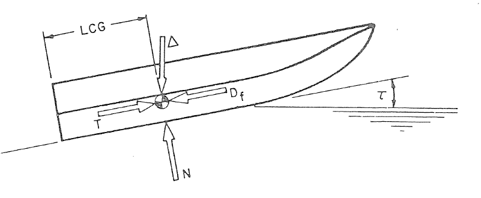
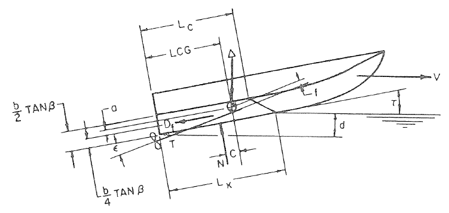
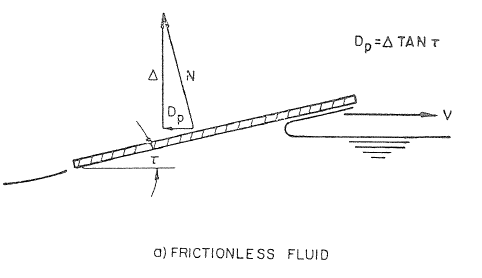
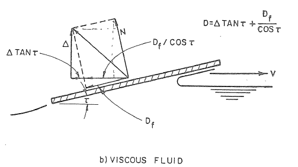
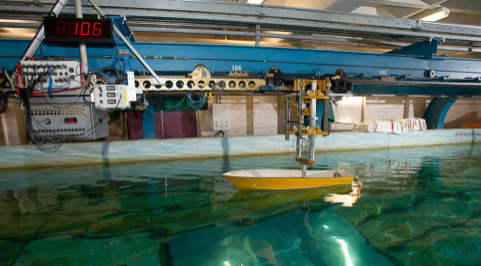
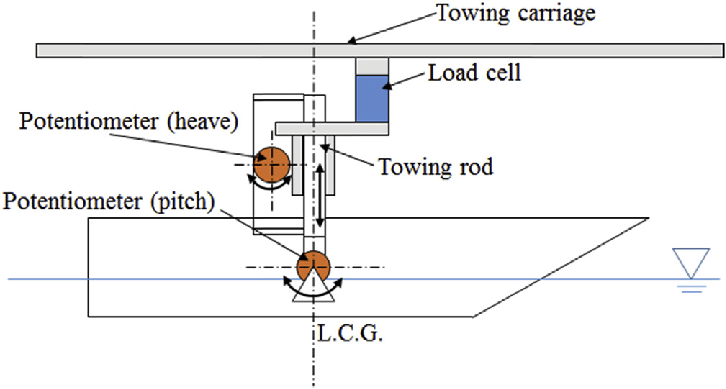
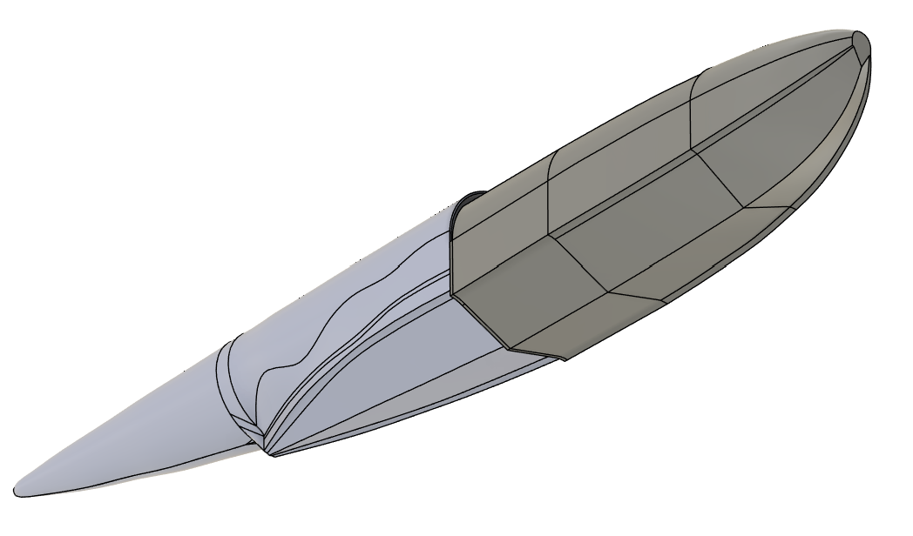
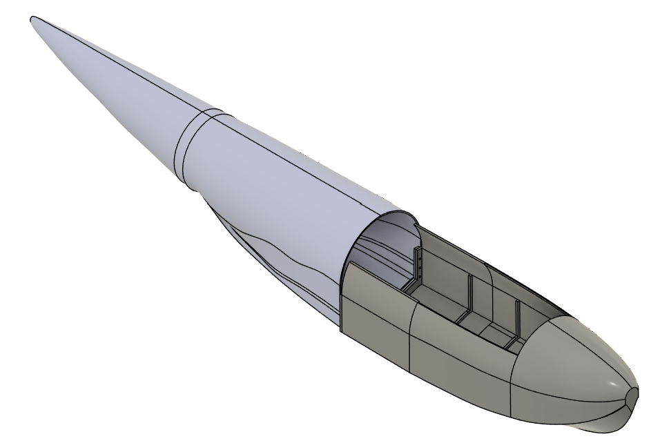

+++
title = 'High speed hydrodynamics'
date = 2026-02-14T11:21:33+05:30
draft = false
+++

This article series explains how I made the ground-effect UAV take off from water. In general, high-speed hydrodynamics lack modern resources. This article would be a small contribution from my side.

Making a plane take off from water is more complicated than making a fast boat and a fast plane. This isn't a vertical-lift-off UAV, and the runway is chaotic.
There is a long American story of why Russians failed, how NASA tried to make a blue whale, which never got out of paper [LINK](https://drive.google.com/file/d/1-fZBEmZvyxrRGafyKTTqvci3ul463WaA/view?usp=sharing)
A few companies that make GE planes are Poseidon; the next closest is Regent.

There is significantly less literature in high-speed hydrodynamics; the literature that exists is mostly experimental. Especially for seaplanes, there is no structured textbook or resources. The closest one is Savitsky's high-speed marine craft study, which is a very extensive empirical study resulting in empirical equations for planning hull designs.

## Prismatic Hull
Hence, I will start with the key learning from this paper, with the objective of understanding the limits. The paper primarily focuses on the force balance and the formation of the wetted surface. How is the pressure distribution and resulting drag, buoyancy, and moments on the moving hull?

  

  

Force and moment balance through the CG

*Lk*: Wetted keel length  
*Lc*: Wetted chine length  
*LCG*: Longitudinal distance of center of gravity from transom (measured along keel)  
*V*: Horizontal velocity of planing surface  
Δ: Load on water  
*T*: Propeller thrust  
*N*: Force normal to the bottom  
*Df*: Frictional drag-force component along bottom surface  
*a*: Distance between *Df* and CG (measured normal to *Df*)  
*f*: Distance between *T* and CG (measured normal to *T*)  
*c*: Distance between *N* and CG (measured normal to *N*)  
*d*: Vertical depth of trailing edge of boat (at keel) below the level water surface  
τ: Trim angle of planing area  
ε: Inclination of thrust line relative to keel line

As with all mechanics problems, we start by identifying all the forces and moments by drawing a free-body diagram. We will compute the magnitude of each as we go. The weight and thrust forces are obvious ones. If you didn't understand all the naming, don't worry, and tag along for the next section.

### Force and moment balance (longitudinal axis)
A major question is how to determine the location of the normal force.

First, we look at how the pressure is distributed when a flat plate moves through water


Now, to understand the structure of the hull and some naming, we look at how a prismatic hull's wetted surface area looks.


Now we need to understand how water flows through the hull's wetted surface and how spray forms.


The suction force created at the interface of the water and hull is the reason boats can't fly using wings. We will discuss this.

The normal force can be found by mapping the water-contact pressure. The paper separates normal forces into dynamic and buoyancy forces, with dynamic forces assumed to have a center of pressure at 75% of the mean wetted area (inspired by the flat-plate pressure distribution), and buoyancy's COP assumed at 33% from the transom. Now, these values give a good match to the test data and the empirical formula, but once you deviate from the prismatic shape, you should modify these values depending on the shape. Based on this generalization, forces can be empirically found for a given trim angle and hull parameters in the paper. Do check out the paper for the formulas and charts.

The Normal force has 2 components: lift and drag (this normal force includes buoyancy forces, and in the paper they are derived as fractions of buoyancy).

  

  

Components of the normal force into drag and lift. Understanding this picture will simplify the formulas you see in the picture a lot.

The general formulation of drag and lift is very similar to that of aerodynamics.

Force = k × 1/2 ρ V2 L2

The constant depends on f(VL/ν) reynolds number, F(V/√(gL)) froude number and  φ(V2L / (σ/ρ)) weber number. In practice, it's obtained through a test or CFD. The characteristic length is generally the beam (width of the hull) or volume1/3.

The paper derives a closed-form equation for *Cl* and *Cd* for a prismatic hull. There are Reynolds number-based corrections to account for changes in frictional resistance due to boundary layer thickness (smaller hulls have a higher frictional component ratio).

Moment balance has another central decision-maker, and that is the trim angle.

The hull's performance is evaluated using the drag-to-lift ratio (very similar to L/D for planes). The prismatic hull is the shape that creates minimal drag at high-speed planing, but with a significant spray problem. All modifications to the chine and bow of the hull are to reduce spray characteristics, increase stability, and reasonably reach the high speed, at the cost of drag.

The conclusion is that this is the best drag/lift ratio any fast-moving shape in water can have. (Depends on surface friction coefficient too; if you use an aluminum hydrophobic coating, drag will reduce)


@note - There is an important concept of hump drag in high-speed hydrodynamics, which happens at Frude number of ~0.5-0.7 and characterises the transition from displacement mode (the hull smoothly cutting through water) or buoyancy lift to planning mode (where the hull rides on top of water) or majority dynamic lift. Essentially, at a specific speed range, the hull has to ride through the waves created by itself (bow interaction), which increases drag considerably.

@note - Always look out for *CV* definitions and units. It's a normalizer for hull lift and drag coefficients and can be defined based on the beam or (load on water) ^1/3.

Although these formulas are heavily dependent on test results, they have significant value as benchmarks. If you do CFD, you would know that usually all the settings for mesh and solvers are determined using validation resources from NASA Langley Research Center - Turbulence Modeling Resource [LINK](https://turbmodels.larc.nasa.gov/naca0012_val.html) for NACA 0012 airfoil (or high lift with flaps) or from drag prediction workshop or high lift workshop results as references. But there is nothing similar for hydrodynamics, multiphase interactions, or anything close (nor anything for ground-effect flights). This prismatic hull serves as the best reference available to calibrate the CFD. You shouldn't believe any CFD results that aren't calibrated against a physical experiment.

### Hydrostatic Stability
General concepts are the same for any body floating in water.

In here, the metacentre is the position along a line perpendicular to the waterline (at equilibrium) passing through the center of gravity. The exact point of MC is the intersection of the above-mentioned line with the buoyancy force vector. Buoyancy always acts at the center of buoyancy, which is the volumetric center of the submerged part of the body. (Hence, a higher water line is better for stability, unlike for drag).



Looking at the picture, try to think when the body would be in unstable equilibrium, and what the range of stable equilibrium is. That's all there is.

In our context, it is essential to understand that stability should be analyzed along both axes of the plane. Along the length, the seaplane has a long body, hence there is a long correcting lever arm, but along the width dimensions are really small in comparison (of the fuselage). The waterline area has a very small lateral moment of inertia, resulting in the metacenter being below the CG. So, the lateral stability for a normal streamlined plane body is poor; the best way to improve it is to add additional buoyancy at the wing tips (one other alternative is stubs [LINK](https://avweb.com/news/dornier-introduces-new-amphibian/)), attach a high buoyancy object at the wing tips for a long corrective lever arm resisting rolling moment.

Now, if you keep something at the very tip of the wing, structurally it's a bad design, hence there is a compromise. Empirically, it's found that if the transverse and longitudinal metacentric heights are nearly equal and the transverse is not larger than the longitudinal, then satisfactory stability is achieved.



The floats are mounted higher than the keel, so as to avoid contact with water at higher speeds and thus reduce drag. But it should be deep enough that we meet the transverse stability criteria. Also, floats should have a planing bottom to furnish dynamic lift even while fully submerged.

@note - Do consider the dynamic force for moment balance while taking off.

Now we will discuss the reserve buoyancy. Reserve buoyancy is the additional buoyancy that the floats can provide in comparison to a stationary waterline. So, think of a situation where, due to disturbances, the plane rolls so much that one float is fully submerged. This would create a corrective moment of magnitude buoyancy force at the float X wing distance, pushing the plane back to stability. Now, the additional buoyancy provided by the float (which is a direct measure of the reserved buoyancy) will determine how strong a disturbance can be handled. Generally, it's recommended to reserve 100% of the buoyancy for floats, but you can calculate the required buoyancy based on the sea state the plane must survive.

You should also ensure that the center of buoyancy and center of gravity lie on the same vertical line normal to the waterline. You can play around with mass distribution along the longitudinal axis to keep the waterline parallel to the keel or to achieve the best dynamic trim with the lowest moment in takeoff. You should keep the mass distribution symmetrical in the transverse axis.

@note - these floats have to be perfectly symmetrical, as a slight imbalance will cause a very high yawing moment (forces acting far from the CG).

## The Hull

When it comes to hulls, I want you to understand that they are pretty much like airfoils: their behaviour can't be fully predicted by first principles, but general design features convey a lot of information. Similar to airfoils, here you will also find charts for lift, drag, and moment coefficients, and, as you may have guessed, standard measurement procedures and normalizations for results to scale across sizes. NASA facility tested many seaplane hulls during World War II and later open-sourced its archive. Here, I will go through one such paper and share links to some other interesting ones.

[AERODYNAMIC AND HYDRODYNAMIC TESTS OF A FAMILY OF MODELS OF FLYING-BOAT HULLS DERIVED FROM A STREAMLINE BODY-NACA MODEL 84 SERIES](https://drive.google.com/file/d/1rKoCDa1SnGaYWayhtA2oYVhR_CcG7RK6/view?usp=sharing)

I recommend that you read the summary section alone. The study aims to derive a planning hull from a perfectly streamlined body by evaluating various alterations, primarily bow and aft body designs, deadrise angle, chine shapes, additional planning surfaces, etc., through towing tank tests and wind tunnel testing. Each alteration affects performance (as summarised), and, most importantly, it is concluded that the aerodynamic drag can be as low as 1.25 times that of a perfectly streamlined body.

This paper presents extensive test results on drag and moments in water and aero (for aero, be careful with the coefficient definitions). Also, it provides very clear diagrams and details for recreating the hull shapes. We will go through definitions first.

Instrumentation details
- Stevens Institute is very well known for its experiments on seaplane designs. And it's an honor to present my work to [Prof. Raju](https://www.stevens.edu/profile/rdatla) who is leading the towing tank testing.

  

  

Towing tank setup.

Free trim test - the following values are measured.
* vertical displacement of model / heave / rise or change of draft
* angle of stable trim
* resistance values

Fixed trim test - the following values are measured.
* vertical displacement of model / heave / rise or change of draft
* Pitching moment exerted by the model
* resistance values

Coefficients
*CΔ* (Load Coefficient): Defined as Δ/wb3.
*CR* (Resistance Coefficient): Defined as R/wb3.
*CV* (Speed Coefficient): Defined as V/√(gb).
*CM* (Trimming-Moment Coefficient): Defined as M/wb4.
*Cd* (Draft Coefficient): Defined as d/b.

Variables
Δ: Load on water, measured in pounds.
*w*: Specific weight of water, measured in pounds per cubic foot (63.3 for these tests; usually taken as 64 for seawater).
*b*: Maximum beam, measured in feet.
*R*: Resistance, measured in pounds.
*V*: Speed, measured in feet per second.
*g*: Acceleration of gravity, 32.2 feet per second squared.
*M*: Trimming moment, measured in pound-feet.
*d*: Draft at main step, measured in feet.



- As you can notice, there are trim values and resistance values for the speed coefficient up to 4. This is not where takeoff happens
- The trim values here are the free trim, ie, the hull is pivoted on the CG while testing, and after the hydrodynamics moment balance, the hull stabilizes itself at this trim. The idea is that the speed is so low that aerodynamic forces can't control the trim at this velocity.
- Notice the shape of the curve, how the trim and resistance increase simultaneously in the shape of a hump.
- *CΔ* is the weight coefficient, as you can see as *CΔ* double resistance increase almost 3 times.
- If you look at the values of the  *CΔ* / *CR*, you will notice it comes out to be L/D and its around 6.6 for *CΔ* = 0.4) and 4.4 for *CΔ* = 0.8. This is the point of maximum thrust.

After each section, extensive images are presented to show the spray characteristics of that particular change. These images are vital for understanding spray characteristics, which will significantly impact wings and propellers. And very soon, spray will be a significant hurdle to take off.



Bow waves are a major hurdle to propeller placement, and, like conventional planes, they can't be placed at wing level. Just because of the spray, they have to be high-mounted and still designed to ingest spray.


Post this section on page 74: there is a new set of studies that go further, from the speed coefficient of 4.5 to 9, where the plane takes off.
- This is a more detailed study, and each graph set you see has a *CV* written on top. Resistance and moments are studied as a function of speed, weight, and trim.
- This is different from the earlier graphs shown for the fixed trim region.
- Depending on the plane's trim and weight, as speed increases, you need to look across graphs for resistance and moments.

The graphs depict the resistance for each trim across the speed range, also showing trim transition for the lowest resistance and lowest moment requirement (design choice based on whether you are power limited vs moment limited)

Post that you will notice the aerodynamic coefficients - I guess it's safe to assume everyone knows how to read it. But be careful, the definitions are not conventional ones and are mentioned on page 73.

I have tested Bow 2B, stern 2C and 4.




After making these drawings into CAD, this is how they look.

  

    
  

  

    
  

CAD done in Fusion360, designed for 3D printing and testing.

Other such reports
[LINK2]()
[LINK1](https://reports.aerade.cranfield.ac.uk/bitstream/handle/1826.2/3390/arc-rm-2834.pdf?sequence=1&isAllowed=y)

## Evaluating hulls
Now we will take these ideas further and go a bit deeper. I recommend [LINK](https://drive.google.com/drive/folders/1-_mFKr5Hu_giDAQSaBu7Lg_rmcxvn8il) going through this. Now you understand drag calculation and how they selected/made that hull design.

First, we should be asking why a prismatic hull can't fly. The answer lies in ventilation: the hull needs air injected beneath it to break free of the water. Also, to achieve high speeds in water, there should be a way to reduce the wetted surface area, compensating for the v^2 increase in dynamic lift without crazy-high trim angles. A step in the hull is the solution; we will discuss in the takeoff section how the trim changes and the aft part of the body can lift off from water, but this won't be possible without a step due to the suction force of water (due to the velocity difference at the intersection with water). As the aft of the hull rises, air rushes in to fill the lower-pressure region, cutting off the suction interface. Now, why can't we inject air (use some pneumatics), which would result in a streamlined fuselage and reduced drag? The answer is yes. Still, there should be a small step for the second condition (this can be retractable). Read the takeoff section to get a better idea.



There are 2 planning surfaces for a stepped hull. The forebody can be treated very similarly to a prismatic hull, but the aft body rides on the wave created by the forebody, and the waterline is below the undisturbed water level. Now, these surfaces can be considered 2 individuals with differences in the surrounding water conditions. The aft part of the hull has an angle relative to the horizontal, called the stern post angle.

For static conditions, we can use the same force balance we discussed earlier, but this time there are 2 normal force components, and the location of the thrust is different (depending on where you mount the propellers), which creates a moment. The split of normal forces can be found through moment balance on the center of gravity from buoyant forces acting at the center of buoyancy of the fore and aft body, which sums to the weight of the plane. The same force balance works out dynamically, but the water level isn't predictable.

The hump in the resistance curve is critical in determining the ability to take off. It's primarily associated with maximum trim and occurs around the same velocity range. The higher the trim at this speed, the greater the resistance (see the graphs in the NASA paper). The ways to decrease trim are
* Decrease sternpost angle
* Increase the length of the aftbody

If you go back to the Force and moment balance picture, you would realize that both actions result in a reduction in aft body buoyancy, and that's the key: if there is only forebody in play, then it's a prismatic hull, which has the least drag form factor.

### Takeoff and Landing sequence
While we are calculating the takeoff, keep in mind that we have wings. As speed increases, the wings take up a portion of the load. Hence, the buoyancy/dynamic lift requirement actually decreases with speed. The takeoff point is where the velocity is just enough that aerodynamic lift from the wings can carry the whole load of the plane.

As the plane's velocity increases, dynamic lift increases and wetted length decreases (lower buoyancy is required to balance weight), i.e., the planning surface decreases or the trim increases, usually simultaneously. After a specific speed, the dynamic lift will pass through the CG and will be equal to the weight at that point, and the aft body leaves the water surface. The plane must remain in equilibrium, and for this, the CG location is most important. The tail's moment (or an underwater flap) can be used to maintain this equilibrium (note that here the tail is providing lift, not downforce). During takeoff, the entire seaplane pivots at the step.

For a stable takeoff, it's essential to consider the transition to being fully airborne. Even though lift forces balance out the difference, if drag is very sudden and a low trim is not maintained, this can result in a pitching moment that the elevator can't control (if the elevator isn't sized to control trim or if it's wet from spray). If the elevator is sized to control hydro trim, then the bigger the plane, the safer the transition due to higher inertia.

The landing sequence is the reverse of the takeoff for a perfect landing on smooth water. At touchdown, the impact should occur at the step and the velocity should be tangential to the water surface. But it is generally far from perfect. The vertical force of impact should be controlled, as after touchdown, the force of impact will proportionately increase the draft line, causing rebound and leaving the water surface. This causes high damping to vertical and horizontal velocity. But if impact velocity is high, it can result in heavy oscillations (discussed in the next section). The impact force is entirely taken by the hull (dampened by the water), constituting an extreme loading condition for structural design.



@note - most of the landing impact and rebound dynamics happens only at step, and prismatic hull approximation hold realistic.

### Dynamic stability
There are 2 significant instability conditions, namely porpoising and skipping (it's the same porpoising from F1). Seaplanes have a region of stable trim angle (lower and upper limits) for stability (keep in mind that waves influence your trim angle). The reason is low damping due to the amount of hydrodynamic forces, and hence, taking off at a lower speed is better. When there is a large amount of hydrodynamic lift at high velocity and a trim angle, a small perturbation can cause a significant force imbalance, combined with low inertia, resulting in sudden vertical/angular motion. If you lose lift, the plane suddenly sinks; the next instant, dynamic lift drastically increases, the plane leaves the water surface due to acceleration, and the cycle repeats.



Skipping is a heave oscillation observed during landing.

## Hydrofoil

By now, you would be wondering: seaplanes are great, but why don't I see one around? In fact, there are very few operational, and their operations are very limited to certain weather conditions. The major problem is that the sea is highly turbulent [youtube](https://www.youtube.com/watch?v=cMNH4nmOims). Even though such waves are not observed in coastlines, the wave-handling capacity of conventional hull seaplanes is very limited.

| Gross buoyancy (lb) |  Wave height (ft) | Examples | Sea State |
|------|------|------|------|
| 2000 | 1 | small STOL planes | 1 |
| 4000 | 1.75-2 | 5 seater jets | 2 |
| 8000  | 2.5 | Bigger than Cessna | 3 |
| 20000 | 3.5 | 20-30 seat Business jets | 3 |
| 100000 | 6 | Heavy private jets | 4 |

If you look at the coastline shores, you can easily notice waves around your height (sea state 4 is moderate breeze and small waves), which means no small planes or private jets can actually be put into service on the majority of the coastlines. To handle sea state 6, a strong breeze, as the trend goes, it would require at least Boeing 787-8. But the catch is that airplanes have much lower structural loading and smaller powertrains, resulting in higher payload capacity for the same MTOW. Now that's a significant problem.

### Why hydrofoil

Bow waves are major problem, additionally at start of the planning for a specific velocity range the water suction (we discussed in prismatic hull case) is higher in magnitude than lift and hence cause rise in water level and higher bow waves - which again results in more drag (trap) only way out is to accelerate through this region fast (bigger powertrain).

The spray height is also an issue, as mostly propellers are mounted on the wings, the propeller sucks the spray and can result in the tail of the plane being fully wet, which can cause you to lose pitching control.

A hull capable of doing 2ft of waves can do 4ft with a 2ft long retractable hydrofoil. That's equivalent to hulls of 3-5 times the buoyancy. To tackle the rougher sea conditions for a given plane size, this is the only way.

### How hydrofoil

The hydrofoil should be able to lift you above the water surface at a very low velocity, but also it shouldn't cavitate before the takeoff velocity. Now, at very low velocity, the moment balance through the aerodynamic tail is not possible due to high moments from the water; hence, if a passive hydrofoil is designed, it should be placed at the CG location, with active controlled flaps (or radars) to control the pitching moment. Or uprooting should be done at a speed where the tail control surface can balance the moments (resulting in a huge tail area).

If designing an active hydrofoil, it's not very different from fast hydrofoil boats; very high-speed active control of the rear hydrofoil is required because it will be in the wake of the leading hydrofoil. Similar to wings' wake, hydrofoil wakes carry high energy (almost all momentum to keep the plane floating is balanced by the wake). [A good visualization of an active hydrofoil system](https://youtube.com/playlist?list=PLKzcubLcBdlTMpCYshZnDhOZDETBflw2V&si=hmjk9oGX_zNWLo_e)

Hydrofoils - velocity range to deploy them, why active control is required, XFLR5 images.

Regent hydrofoil is a great masterpiece.


The string marked in yellow rotates the pulley marked in yellow, which through a belt drive, rotates the gears attached to the screw drive linear actuator. The linear actuator pulls the hydrofoil up/down. Do notice that there are no flaps on the main foil. Watch the  SailGp tech video to have a good look at titanium-made hydrofoils, how long, smooth, and sharp they are. Also, notice the spray from SailGp boats.



Spray from the hydrofoil on a seaplane.


## The proto



--------------------------------------
